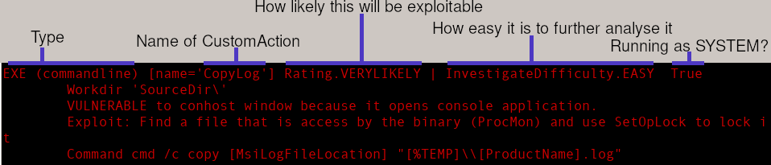

# MSI Analyzer

This Python script for Linux can analyze Microsoft Windows *.msi Installer files and point out potential vulnerabilites. It was developed by Michael Baer (@derbaer0) in the SEC Consult Vulnerability Lab.

Currently, it is mostly suited for a local privilege escalation also described in our blog post: https://r.sec-consult.com/msi.

Microsoft assigned **CVE-2024-38014** and also provided a patch for this vulnerability at the September 2024 patch day: https://msrc.microsoft.com/update-guide/en-US/advisory/CVE-2024-38014.

The script can also be used to get an overview of an installer and identify potential weaknesses.

## Keep In Mind
- This script is work in progress.
- It is not perfect, but hopefully covers many installers correctly. Please create a github issue in case you encounter one with a wrong verdict.
	- false-negatives (if the console application is only indirectly started from the installer)
	- "false-positives" (same actions are executed conditionally. The script shows the condition but does not evaluate it)
- This script is **NOT** secured against malicious installers.

## Installation
You need some python packages. `sqlite3`, `termcolor`, maybe more. Otherwise, no installation is required. Just run the script from the main folder.

Install the (apt) package `msitools`. It contains `msiinfo` and `msiextract` that are needed as well.
```bash
sudo apt install msitools
```

## How To Use
- `python msiscan.py <Installer>`
- Or if you want to check a whole directory: `./runall.sh <directory>`

Now scan the result for unusual colors (red) for quick wins. Advise: If there is something red, repair it with ProcMon and do the manual approach.

There will be errors. Just ignore them. The analysis tries to continue if possible.

If you see a red line in the beginning `Repairmode disabled ...`, you will not be able to trigger the repair function.

Now, a few explanations to understand the output if you want to invest some time in deeper analysis:



- **Rating** My guess, how likely it will be exploitable. This also defines the color.
- **Difficulty** My guess on how much effort it takes to find a vulnerability. E.g., HARD = Binary Reversing.
- Green line "Action only invoked upon": This action is only invoked when the condition is true. E.g. "Not Installed" is only executed, when the software is not yet installed = during the installation, but not the repair. You are out of luck unless you can force the installation to take place. (Note: It feels like sometimes these conditions do not match reality somehow. But I could not figure this out yet).
- Orange: There is script code. If you have some time, look there for fishy actions. Or invocation of binaries (`CreateObject ("WScript.Shell")`).
- Blue: Method from the WiX toolset. Probably safe (but should be differentiated and investigated further). 
- Cyan: Most common color. Normally they invoke GUI programs or DLL functions. No quick win is expected here.

## What's next?
I believe there is still a lot to extract from installer packages. E.g., permissions of folders and services that get installed might quickly identify more LPE vectors.


